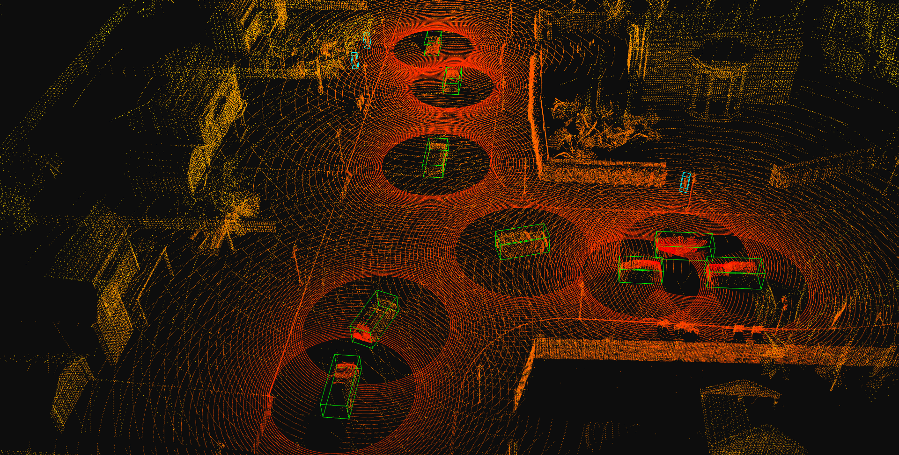

# Cooperative Driving Dataset (CODD)

This repository contains the code to generate a cooperative driving dataset using the [CARLA](https://github.com/carla-simulator/carla) simulator.
The dataset is composed of snippets, which are independent sequences in different scenarios.
The snippets are saved in efficient HDF5 storage containers.
We describe the structure of the dataset and how to generate data below.



## Requirements
- CARLA >= 0.9.10 
- Python 3.X
- h5py
- Mayavi >= 4.7.2 (optional, for visualisation)

Note: If the CARLA python package is not available in the python path you need to manually provide the path to the `.egg` file in `fixpath.py`.

## Snippets / Data structure
A snippet is a sequence of temporal frames in an environment. Each frame in a snippet contains sensor data (lidar) from **all** vehicles in the environment, as well as the absolute pose of the sensor and ground-truth annotations for the 3D bounding boxes of vehicles and pedestrians.
Each snippet is saved as an HDF5 file with the following arrays (HDF5 datasets):

- `pointcloud` with dimensions `[frames, vehicles, points_per_cloud, 4]` where the last dimensions represent the X,Y,Z and intensity coordinates of the lidar points.
- `lidar_pose` with dimensions `[frames, vehicles, 6]` where the last coordinates represent the X,Y,Z,pitch,yaw,roll of the global sensor pose.
- `vehicle_boundingbox` with dimensions `[frames, vehicles, 8]` where the last coordinates represent the 3DBB encoded by X,Y,Z,yaw,pitch,Width,Length,Height. Note that the X,Y,Z correspond to the centre of the 3DBB in the global coordinates. We do not include roll as it is irrelevant for this application.
- `pedestrian_boundingbox` with dimensions `[frames, pedestrians , 8]` where the last coordinates represent the 3DBB encoded as before.

Where
- `frames` indicate the number of frames in the snippet. 
- `vehicles` is the number of vehicles in the environment. Note that all vehicles have lidars that we use to collect data.
- `point_per_cloud` is the maximum number of points per pointcloud. Sometimes a given pointcloud will have less points that this maximum, in that case we pad the entries with zeros to be able to concatenate them into a uniformly sized array.
- `pedestrians` is the number of pedestrians in the environment.

Notes:
1. The point clouds are in the local coordinate system of each sensor, whose pose is given by `lidar_pose`.
2. Angles are always in degrees.
3. Pose is represented using the UnrealEngine4 left-hand coordinate system. An example to reconstruct a transformation matrix from local -> global is available in `vis.py`, where such matrix is used to aggregate all local lidar point clouds into a global reference system.
4. The vehicle index is shared across `pointcloud`, `lidar_pose` and `vehicle_boundingbox`, i.e. the point cloud at index [frame,i] correspond to the vehicle with bounding box at [frame,i].
5. The vehicle and pedestrian indeces are consistent across frames, allowing to determine the track of a given vehicle/pedestrian.

## Generating data
To generate the data one must firstly start the CARLA simlator:
```
cd CARLA_PATH
./CARLAUE4.sh
```

Then one can create a snippet using
```
python genSnippet.py --map Town03 --fps 5 --frames 50 --burn 30 --nvehicles 10 --npedestrians 3 --range 100 -s test.hdf5
```
This creates a snippet `test.hdf5` in Town03 with a rate of 5 frames per second, saving 50 frames (corresponds to 10s of simulation time) in a scenario with 10 vehicles (we collect lidar data from all of them) and 3 pedestrians.
The `burn` argument is used to discard the first 30 frames since the vehicles will be stopped or slowly moving (due to inertia), so we would get many highly correlated frames without new information.
Note that this script randomly select a location in the map and tries to spawn all the vehicles within `range` meters of this location, which increases the likelihood the vehicles will share their field-of-view (see one another).
The range also specifies the maximum range of the lidar sensors.
For more options, such as the number of points per cloud or the number of lidar lasers, or the lower lidar angle, see `python genSnippet.py -h`.

Alternatively, to generate a collection of snippets one can use
```
python genDataset.py N
```
where `N` specifies the number of snippets to generate.
This script randomly selects a map and sample from specific distributions for number of vehicles and pedestrians.
Other options may be individually set-up within the script.

Note: Town06,Town07 and Town10HD need to be installed separately in CARLA, see [here](https://carla.readthedocs.io/en/latest/start_quickstart/#import-additional-assets).

## Visualising data
To visualise the data one can use
```
python vis.py [path_to_snippet]
```

Note that you may want to pause the animation and adjust the view.
The visualisation iteratively goes through all the frames, presenting the fused point cloud from all vehicles.
It also shows the ground-truth bounding boxes for vehicles (in green) and pedestrians (in cyan).

## Our dataset parameters
For our CODD generated dataset, link to be provided, we selected the following parameters:

- 5 fps
- 125 frames (corresponding to 25s of simulation time per snippet)
- 50k point per cloud
- 100m lidar range
- 30 burnt frames
- nvehicles from a binomial distribution with mean 10 and var 5
- npedestrians from a binomial distribution with mean 5 and var 2
